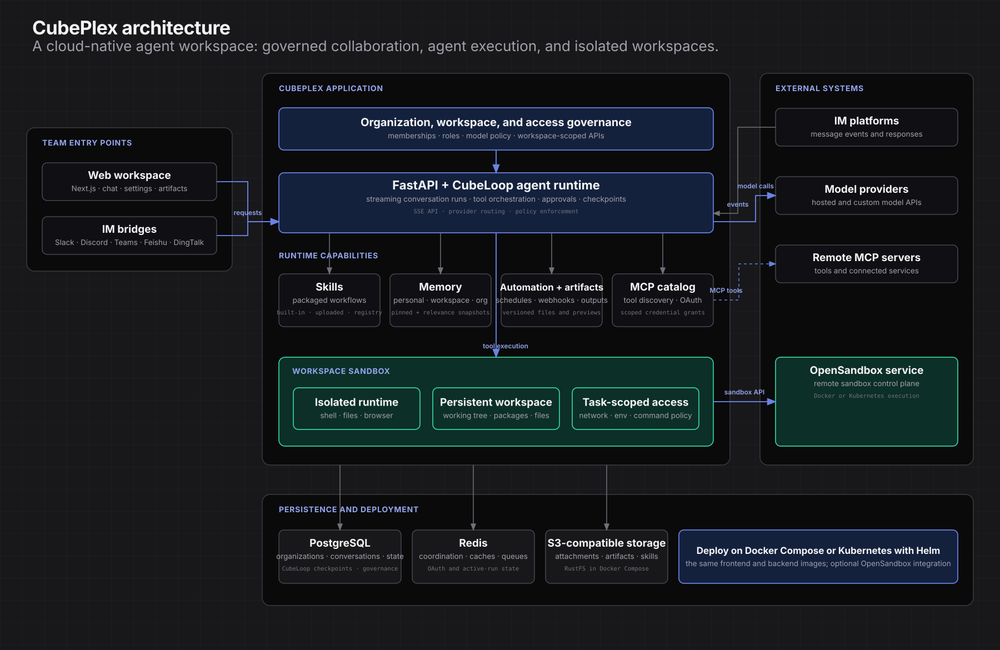

<p align="center">
  <picture>
    <source
      media="(prefers-color-scheme: dark)"
      srcset="frontend/packages/web/public/brand/cubeplex-lockup-on-dark.svg"
    />
    
  </picture>
</p>

<p align="center">
  <strong>Cloud-native platform for managed agents in team workspaces</strong>
</p>

<p align="center">
  <a href="https://github.com/cubeplexai/cubeplex/actions/workflows/ci.yml">
    
  </a>
  <a href="https://docs.cubeplex.ai">
    
  </a>
  <a href="https://cubeplex.ai">
    
  </a>
  
  
  <a href="https://cubeplex.ai/docs/deployment/overview">
    
  </a>
</p>

CubePlex is a cloud-native platform for managed agents in team workspaces —
skills, shared memory, MCP tools, persistent sandboxes, governed access, and
self-hosted deploy on Docker Compose or Kubernetes.

<p align="center">
  
</p>

The diagram reflects the current application architecture. CubePlex's agent
runtime is built on [CubePi](https://github.com/cubeplexai/cubepi), an
async-native agent framework for multi-provider model access, tool execution,
streaming, middleware, and durable checkpoints. Workspace sandboxes
are isolated execution environments with persistent working state; external
model providers, MCP servers, and IM platforms remain outside CubePlex's trust
boundary.

## Demos

<div align="center">
  <video src="https://github.com/user-attachments/assets/716b9d39-e74a-4ae6-a053-d0c8d7a0af47" width="100%" controls></video>
</div>

> **Build Interactive Website** — a full product website generated from a single prompt.

<div align="center">
  <video src="https://github.com/user-attachments/assets/d93360b7-8141-42c9-bc4f-3d9488a309b1" width="100%" controls></video>
</div>

> **Skills Workflow** — find a skill, install it and use it to build agentic frontend, end to end.

<div align="center">
  <video src="https://github.com/user-attachments/assets/85975ccb-b512-45ff-96d2-0b7df7c8de57" width="100%" controls></video>
</div>

> **Data Analysis** — transform raw tabular data into a formatted spreadsheet.

<div align="center">
  <video src="https://github.com/user-attachments/assets/c8ad3c71-4102-4bcb-931a-5fc9378be140" width="100%" controls></video>
</div>

> **One-Page PDF** — turn a one-page PDF into a polished, navigable page.

<div align="center">
  <video src="https://github.com/user-attachments/assets/1d979ec6-7ddc-489b-bb43-9f4c78c89b38" width="100%" controls></video>
</div>

> **Browser Control** — an agent drives the browser to complete a task autonomously.


## Features

| Area | What you get |
|---|---|
| **Multi-model chat** | Hosted and custom providers (Anthropic, OpenAI, and more). Attach files, stream replies, switch models mid-conversation. |
| **Skills** | Packaged agent capabilities — built-in, org-uploaded, or from remote registries (e.g. skills.sh). |
| **Memory** | Personal, workspace, and org-scoped memory the agent recalls across conversations. |
| **MCP tools** | Catalog of connectors with static credentials or OAuth; grant tools per workspace. |
| **Workspace sandboxes** | Per-workspace isolated runtimes with **persistent storage** — files, packages, and the working tree survive restarts so agents resume the same work site. |
| **Artifacts** | Versioned deliverables — files, previews, code, images — rendered in the thread. |
| **Automation** | Scheduled tasks (cron / interval / one-shot) and webhook event triggers. |
| **IM bridges** | Talk to agents from Slack, Discord, Teams, Feishu, DingTalk, and more. |
| **Team governance** | Organizations, workspaces, roles, model access policies, and cost tracking. |
| **Deploy anywhere** | Docker Compose for a single host; Helm for Kubernetes. |

## Get started

- **Docker Compose** (single host): [installation guide](https://cubeplex.ai/docs/deployment/docker-compose)
- **Kubernetes with Helm**: [installation guide](https://cubeplex.ai/docs/deployment/kubernetes)

Both modes use the same backend and frontend images. Guides cover image builds,
configuration, secrets, and verification.

## Develop locally

Prerequisites: Python 3.12+, Node.js 20+, pnpm 10+, and Docker (recommended for
local services).

```bash
git clone https://github.com/cubeplexai/cubeplex.git
cd cubeplex
make install

# Terminal 1 — API
cd backend && python main.py

# Terminal 2 — web UI
cd frontend && pnpm dev
```

Backend: `http://localhost:8000` · Frontend: `http://localhost:3000`.

Local setup also needs backend env/config files described in the
[contribution guide](CONTRIBUTING.md).

## Repository layout

```text
backend/    FastAPI API and Cubepi-based agent runtime
frontend/   Next.js web app and shared TypeScript packages
deploy/     Docker Compose and Kubernetes/Helm assets
docs/       Product docs site and engineering reference
scripts/    Worktree provisioning and dev helpers
```

## Documentation and contributing

- [Documentation site](https://docs.cubeplex.ai)
- [Core concepts](docs/site/docs/getting-started/core-concepts.md)
- [Deployment overview](deploy/README.md)
- [Contributing](CONTRIBUTING.md)
- [Agent guidance (AGENTS.md)](AGENTS.md)
